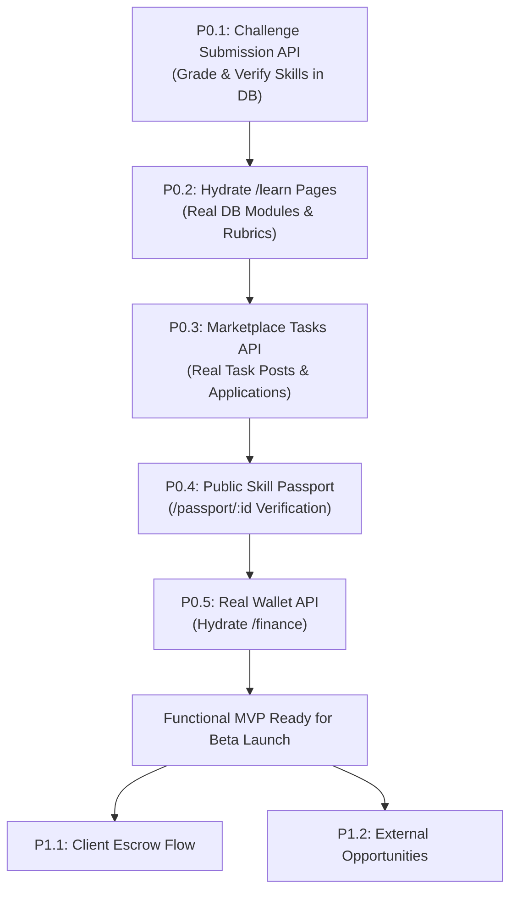

# UPORA — MVP Execution Roadmap
**Date**: September 15, 2026  
**Status**: Active Production Plan  

This roadmap prioritizes the remaining work to transform UPORA into a genuinely functional, end-to-end MVP.

---

## Priority Levels

- **P0 — Absolutely Required for a Real MVP**: Core loops without which the product cannot deliver on "Learn. Work. Earn. Grow."
- **P1 — Important but Can Follow MVP**: Features that strengthen trust, operations, and retention after the core loop is operational.
- **P2 — Future Enhancement**: Advanced scalability, institutional tooling, and automated integrations.

---

## P0: Absolutely Required for a Real MVP

The core user loop must work end-to-end:
$$\text{Register} \to \text{Onboard} \to \text{Solve Challenge} \to \text{Get Verified} \to \text{Apply to Task} \to \text{Deliver Work} \to \text{View Balance}$$

### P0.1 Practical Challenge Submission & Verification Engine
- **Objective**: When a learner completes an incident triage, code challenge, or SQL analysis on `/learn/[slug]`, the submission must be persisted to PostgreSQL, evaluated against rubrics, and permanently upgrade their skill tier.
- **Deliverables**:
  - `POST /api/challenges/[id]/submit`: Accepts submission payload (markdown report, code, answers), validates input, executes rubric evaluation.
  - Persists record in `ProjectSubmission` with score, status (`PASSED`/`REJECTED`), and feedback.
  - On pass: Upgrades or creates `UserSkill` with `tier: PROJECT_VERIFIED`, sets `verifiedAt: now()`.
  - Advances active `RoadmapMilestone` to `COMPLETED` and unlocks the next milestone (`status: AVAILABLE`).
- **Dependencies**: `prisma.projectSubmission`, `prisma.userSkill`, `prisma.roadmapMilestone`.

### P0.2 Hydrate Practical Learning (`/learn` & `/learn/[slug]`) with Database Data
- **Objective**: Remove mock data from the learning flow. Learners see real challenges and rubrics stored in PostgreSQL.
- **Deliverables**:
  - `GET /api/challenges`: Returns active learning modules with associated skills and challenges.
  - Hydrate `/learn` page with database modules seeded via `prisma/seed.ts`.
  - Hydrate `/learn/[slug]` with database challenge brief, starter templates, and rubric weights.

### P0.3 Real Marketplace Tasks & Applications (`/api/tasks`)
- **Objective**: Enable workers to discover real client tasks and apply with verified skills, and allow clients to post tasks.
- **Deliverables**:
  - `GET /api/tasks`: Returns active tasks from `MarketplaceTask` with filtering by tier (`FOUNDATIONAL`, `INTERMEDIATE`, `ADVANCED`).
  - `POST /api/tasks`: Authenticated client endpoint to post tasks with required skills, budget, and deadline.
  - `POST /api/tasks/[id]/apply`: Authenticated worker endpoint to submit a pitch and proposal amount. Enforces skill prerequisite checks.
  - Hydrate `/work` page with live tasks and real application submission.

### P0.4 Public Skill Passport Verification Route (`/passport/[userId]`)
- **Objective**: Give every learner an external, public URL they can share with employers or clients that displays only their verified proof-of-work deliverables and rubric scores.
- **Deliverables**:
  - `GET /api/passport/[userId]`: Public endpoint returning public profile and only skills with tier `PROJECT_VERIFIED` or `CLIENT_VALIDATED` (filters out `SELF_REPORTED` unless explicitly marked).
  - Page `/passport/[userId]`: Server-rendered, fast-loading, mobile-friendly public verification page with cryptographic evidence badge.
  - Connect private `/passport` view to real user data from `/api/profile`.

### P0.5 Real Wallet & Balance Telemetry (`/api/wallet`)
- **Objective**: Display genuine wallet balances and transactions derived from PostgreSQL.
- **Deliverables**:
  - `GET /api/wallet`: Returns authenticated user's `availableBalance`, `pendingEscrowBalance`, `lifetimeEarnings`, and recent transactions from `PaymentTransaction`.
  - Hydrate `/finance` page with live database wallet data instead of localStorage simulations.

### P0.6 Auth Route Rate Limiting & Abuse Prevention
- **Objective**: Prevent brute-force password cracking and account registration flooding.
- **Deliverables**:
  - In-memory or Edge rate limiting on `POST /api/auth/login` (max 5 attempts per 15 minutes per IP) and `POST /api/auth/register` (max 3 accounts per hour per IP).

---

## P1: Important but Can Follow MVP

Features that add business integrity, client workflow, and external opportunities after the core loop is functional.

### P1.1 Client Contract & Escrow Management
- Client accepts a `TaskApplication` $\to$ `Contract` created in status `AWAITING_ESCROW`.
- Client funds milestone $\to$ status moves to `ACTIVE`.
- Worker submits deliverable $\to$ client approves $\to$ milestone paid out to worker `Wallet`.

### P1.2 External Opportunity Engine Sync
- `GET /api/opportunities`: Endpoint querying `ExternalOpportunity` table with trust status filtering (`VERIFIED`, `NEEDS_REVIEW`).
- Hydrate `/opportunities` page with real verified external fellowships, grants, and remote apprenticeships.

### P1.3 Dynamic Reputation Scoring Engine
- Implements transparent reputation recalculation upon milestone completion, on-time delivery, and review ratings.
- Records changes to `ReputationLog`.

### P1.4 Email Verification & Password Reset
- Integrate transactional email (e.g. Resend / Postmark / SendGrid) to verify emails (`isEmailVerified: true`) and support secure password reset tokens.

### P1.5 Client Dashboard (`/client/*`)
- Dedicated view for client accounts to manage posted tasks, review incoming talent applications, inspect applicant Skill Passports, and approve deliverables.

---

## P2: Future Enhancement

Long-term scalability and platform automation.

### P2.1 Live Payment Gateway Integrations
- Stripe Connect for US/EU/UK bank payouts.
- Flutterwave / Paystack for African cross-border local currency payouts.
- Automated tax documentation and KYC compliance.

### P2.2 Automated Code Execution Sandbox
- Isolated Docker/Wasm container runner for evaluating programming submissions against automated unit tests.

### P2.3 Multi-Factor Authentication (2FA / TOTP)
- Authenticator app TOTP verification using `twoFactorSecret` already present in Prisma schema.

### P2.4 Dispute Resolution Center
- Administrative interface to mediate disputed contracts via `ContractDispute`.

---

## Milestone Execution Sequence

